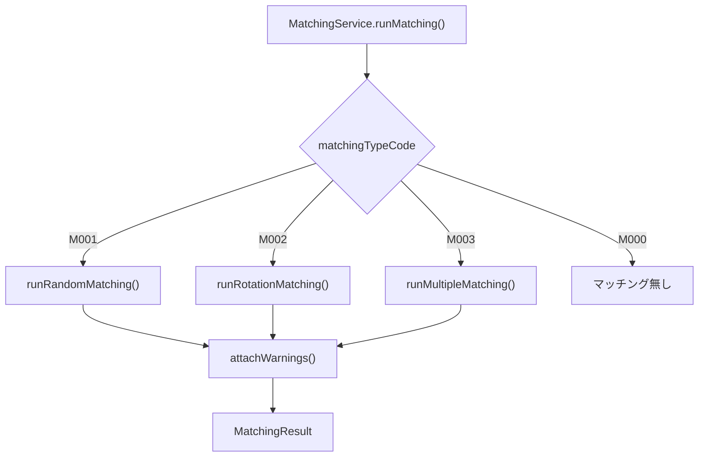
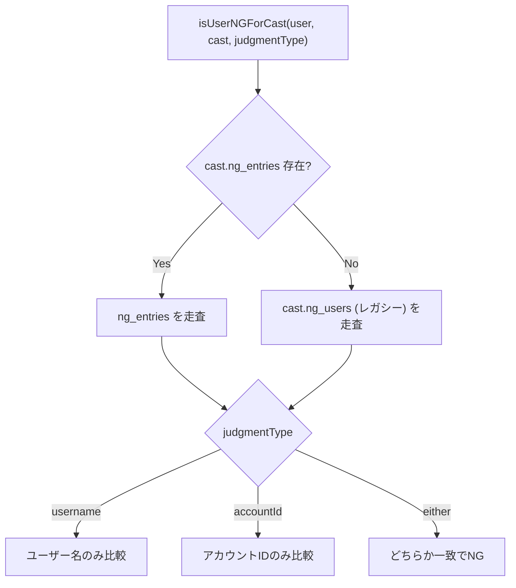
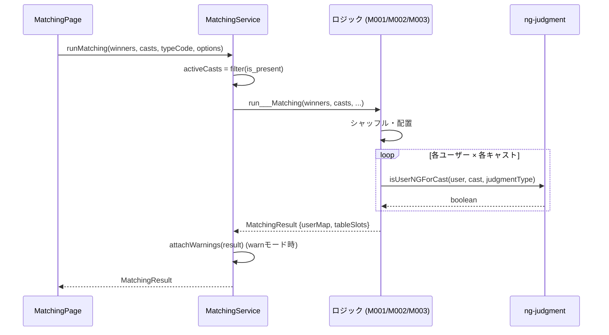

# マッチングロジック詳細仕様書

> **対象ソースコード**: `desktop/src/features/matching/logics/` 配下  
> **評価日**: 2026-02-17  

---

## 1. 全体アーキテクチャ



- **区分コードで完全分離**: 各ロジックは独立ファイルに実装されており、共通化は意図的に行われていない
- **エントリポイント**: `MatchingService.runMatching()` が区分コードに応じて適切なロジックに振り分け
- **警告付与**: `attachWarnings()` が結果に対して NG 判定のフラグを後付け

---

## 2. 共通の仕組み

### 2.1 希望ランクと重み付け

全ロジック共通で以下の重み付けが適用される。

| 希望順位 | ランク値 | 重み (weight) | 備考 |
|:--------:|:--------:|:------------:|:-----|
| 第1希望 | 1 | **100** | 最優先 |
| 第2希望 | 2 | **70** | 高優先 |
| 第3希望 | 3 | **40** | 中優先 |
| 第4希望以降 | 4+ | **10** | 重み付け最小 |
| 希望外 | 0 | **10** | 希望リストに含まれない |

```typescript
const RANK_WEIGHTS: Record<number, number> = { 1: 100, 2: 70, 3: 40 };
const DEFAULT_WEIGHT = 10;
```

### 2.2 加重ランダム選択 (`weightedRandomIndex`)

候補の `weight` 合計を母集団とし、ランダム値でインデックスを選択する。

```
例: 候補 A(w=100), B(w=70), C(w=40)
    合計 = 210
    A の選択確率 = 100/210 ≈ 47.6%
    B の選択確率 =  70/210 ≈ 33.3%
    C の選択確率 =  40/210 ≈ 19.0%
```

### 2.3 NG判定 (`ng-judgment.ts`)



- **正規化**: 前後空白トリム + 小文字変換
- **IDの@除去**: アカウントIDの先頭 `@` は比較時に除去
- **2つのモード**:
  - **exclude**: マッチング時に NG ペアを自動排除
  - **warn**: マッチングは通常通り実行し、NG ペアにフラグ付与

---

## 3. M001: ランダムマッチング

**ファイル**: `random-sheets.ts`

### 3.1 概要

各ローテーションごとに、当選者をシャッフルして順にキャストを割り当てる。希望キャストの重み付けにより、第1希望ほど選ばれやすい。

### 3.2 アルゴリズム

```
各ラウンド r について:
  1. キャストプールをシャッフル
  2. 空席テーブル分のキャストをプールから除外
  3. 当選者をシャッフル
  4. まだ希望キャスト(1-3位)に当たっていない人を優先配置
  5. 各ユーザーに対して:
     a. 第1〜第3希望のキャストが利用可能なら加重ランダム選択
     b. 希望キャストがいなければ未消費キャストからランダム選択
     c. 過去ラウンドで割当済みキャストは候補から除外
  6. 選択されたキャストをプールから除去
```

### 3.3 特徴

- **1ユーザー:1キャスト/ラウンド**: 各ラウンドでユーザーは1人のキャストと組む
- **重複排除**: 過去ラウンドで組んだキャストは同じペアにならない
- **空席対応**: `totalTables - winners.length` 分の空席テーブルを生成
- **優先配置**: まだ第1〜3希望に当たっていないユーザーが先に選択権を得る

---

## 4. M002: ローテーションマッチング

**ファイル**: `rotation-sheets.ts`

### 4.1 概要

キャスト配列に対する循環シフトで全体のマッチングを決定する。テーブルとキャストの対応が規則的に回転する。

### 4.2 アルゴリズム

```
1. キャストをシャッフルし、slotCount 分を抽出 (= baseCasts)
2. 全オフセット (0 ~ baseCasts.length-1) について:
   a. 各ユーザー × 各ラウンドのキャスト割り当てを計算
      → baseCasts[(offset + row - r + baseCasts.length) % baseCasts.length]
   b. 割り当てスコア = Σ RANK_WEIGHTS[希望ランク]
   c. NG があるオフセットは除外
3. 有効なオフセットから加重ランダムで1つ選択
4. 選択されたオフセットで全テーブルの結果を構築
```

### 4.3 配置パターン（例: 5スロット, 3ラウンド, offset=0）

| | ラウンド1 | ラウンド2 | ラウンド3 |
|:--:|:--:|:--:|:--:|
| スロット0 | C[0] | C[4] | C[3] |
| スロット1 | C[1] | C[0] | C[4] |
| スロット2 | C[2] | C[1] | C[0] |
| スロット3 | C[3] | C[2] | C[1] |
| スロット4 | C[4] | C[3] | C[2] |

→ 全スロットが異なるキャストを一巡する

### 4.4 特徴

- **決定的配置**: オフセットが決定すれば全結果が確定（ラウンドごとの乱数なし）
- **完全循環**: キャスト数 ≥ スロット数 の場合、各ラウンドで同じキャストが重複しない
- **空席込み**: 空席テーブルもローテ対象（キャストは空席テーブルにも「配置」される）

---

## 5. M003: 多対多ローテーションマッチング

**ファイル**: `multiple-matching.ts`

### 5.1 概要

複数ユーザーが同じテーブルに着席し、キャストが「ユニット」（固定編成グループ）として各テーブルを巡回する。

### 5.2 パラメータ

| パラメータ | 説明 |
|:--|:--|
| `usersPerTable` | 1テーブルあたりのユーザー数 |
| `castsPerRotation` | 1ローテーションあたりのキャスト数 (= ユニットサイズ) |
| `rotationCount` | ローテーション回数 |

### 5.3 アルゴリズム

```
1. バリデーション:
   - winners.length % usersPerTable === 0 であること
   - activeCasts.length % castsPerRotation === 0 であること
   - unitCount >= tableCount であること
2. ユーザーをシャッフルし、usersPerTable 人ずつテーブルに分割
3. キャストをシャッフルし、castsPerRotation 人ずつユニットに編成（固定）
4. 全オフセット (0 ~ unitCount-1) について:
   a. テーブル t がラウンド r で見るユニット:
      → units[(offset - t + r + unitCount * ROUNDS) % unitCount]
   b. テーブル内全ユーザー × ユニット内全キャストのスコアを合算
   c. NG があるオフセットは除外
5. 有効なオフセットから加重ランダムで1つ選択
6. 結果を構築
```

### 5.4 特徴

- **テーブル固定**: ユーザーはテーブルに着席したまま動かない
- **ユニット巡回**: キャストユニットが各テーブルを順に訪問
- **対角線配置**: M002 と類似した循環シフトだが、粒度がユニット単位
- **厳密なバリデーション**: ユーザー数・キャスト数の倍数制約を厳守

---

## 6. 整合性・平等性の評価

### 6.1 M001（ランダムマッチング）の評価

#### ✅ 良い点
- **優先配置メカニズム**: まだ希望キャストに当たっていないユーザーを先に処理する仕組みがあり、全員に最低1回は希望キャストに当たるチャンスを与えようとしている
- **重複排除**: 同じキャストと複数回組むことを防止
- **NG 自動排除**: NG ペアが自動的に除外される

#### ⚠️ 課題・改善余地

1. **処理順序バイアス**
   - ユーザーリストはラウンドごとにシャッフルされるが、`needsPreferred`（希望未達成者）が常に先に処理される
   - 後半のユーザーは選択肢が少なくなりがち
   - **影響度**: 中。ラウンドごとにシャッフルされるため完全に不公平ではないが、ラウンド1で後ろに回ったユーザーは希望キャストを取られやすい

2. **空席キャスト消費の偏り**
   - 空席分のキャストは配列の先頭から除去される（`availableThisRound.slice(vacantCount)`）
   - シャッフル後なのでランダムだが、消費されるキャストに偏りが生じる可能性あり
   - **影響度**: 低。事前シャッフル済みなので問題は小さい

3. **第4希望以降の扱い**
   - 第4希望以降は `getPreferenceRank` で検出されるがスコアリングには使われない
   - 第1〜3希望のみが加重ランダムの候補になり、第4希望以降はフォールバック（完全ランダム）として扱われる
   - **影響度**: 低。仕様通りの動作

### 6.2 M002（ローテーションマッチング）の評価

#### ✅ 良い点
- **完全循環**: 全ユーザーが異なるキャストと組むことが保証される（キャスト数が十分な場合）
- **NG排除付きオフセット探索**: NG ペアを含むオフセットを除外した上でスコアリング
- **加重ランダムで最適化**: 複数の有効オフセットから、希望との一致度が高いものほど選ばれやすい

#### ⚠️ 課題・改善余地

1. **ユーザー順序依存**
   - `winners` 配列の順序がそのままスロット配置に使われる（シャッフルなし）
   - 配列の先頭に近いユーザーと末尾のユーザーで、割り当てられるキャストの偏りが生じうる
   - **影響度**: 高。**ユーザー配列がシャッフルされていないため、入力順によって結果が偏る**

2. **キャスト数制約**
   - `baseCasts` は `Math.min(slotCount, shuffledCasts.length)` で切り取られるため、キャスト数 < スロット数の場合、一部スロットにキャストが割り当たらないラウンドが生じる
   - **影響度**: 中。キャスト不足時のフォールバックが不明確

3. **単一オフセットによる決定**
   - 1つのオフセット値で全結果が確定するため、局所的な最適化ができない
   - ある特定のユーザーにとっては非常に不利なオフセットが選ばれることがある
   - **影響度**: 中。全体最適だが個別最適ではない

### 6.3 M003（多対多ローテーションマッチング）の評価

#### ✅ 良い点
- **ユーザーシャッフル**: テーブル分割前にユーザーをシャッフルしており、テーブル割り当てに偏りがない
- **厳密なバリデーション**: 倍数制約を事前チェック
- **フォールバック**: 全オフセットが NG で無効な場合でもスコア最大のオフセットを選択

#### ⚠️ 課題・改善余地

1. **ユニット編成がランダム固定**
   - キャストユニットの編成はシャッフル後に先頭から切り出すだけで、ユーザーの希望を考慮しない
   - **影響度**: 中。希望キャストが同じユニットに集中/分散する確率がランダムに依存

2. **テーブル間の公平性**
   - 対角線配置なので、テーブル番号が小さいほど最初の方のユニットを見る
   - ユニット自体がランダム編成なので大きな偏りにはならないが、特定の組み合わせが有利になるケースはある
   - **影響度**: 低〜中

3. **NG排除がオフセット単位**
   - 1つでも NG ペアがあるとオフセット全体が無効になるため、NG が多い場合は有効なオフセットがなくなりやすい
   - フォールバック時は NG を無視してスコア最大を選択するため、NG ペアが残る可能性がある
   - **影響度**: 中。NG ユーザーが多い場合に問題となる

### 6.4 総合評価

| 評価軸 | M001 | M002 | M003 |
|:------|:----:|:----:|:----:|
| **整合性** (結果の正しさ) | ⭐⭐⭐⭐ | ⭐⭐⭐⭐ | ⭐⭐⭐⭐ |
| **平等性** (全員に公平か) | ⭐⭐⭐ | ⭐⭐ | ⭐⭐⭐ |
| **希望反映度** | ⭐⭐⭐⭐ | ⭐⭐⭐ | ⭐⭐⭐ |
| **NG対応** | ⭐⭐⭐⭐ | ⭐⭐⭐ | ⭐⭐⭐ |
| **スケーラビリティ** | ⭐⭐⭐⭐ | ⭐⭐⭐ | ⭐⭐⭐ |

#### 最重要の改善提案

> **M002 のユーザーシャッフル欠如**
> 
> `rotation-sheets.ts` では `winners` 配列がシャッフルされずにそのままスロットに配置されます。
> M001 や M003 ではシャッフルされているのに対し、M002 だけがこの処理を欠いているため、
> 入力順序によって結果が系統的に偏ります。
> 
> **修正案**: `runRotationMatching` の冒頭で winners をシャッフルするコードを追加する。

---

## 7. ファイル構成

```
desktop/src/features/matching/
├── logics/
│   ├── matching_service.ts        # エントリポイント・振り分け
│   ├── matching-result-types.ts   # 結果型定義
│   ├── random-sheets.ts           # M001: ランダムマッチング
│   ├── rotation-sheets.ts         # M002: ローテーションマッチング
│   ├── multiple-matching.ts       # M003: 多対多ローテーション
│   ├── ng-judgment.ts             # NG判定ロジック
│   └── caution-user.ts            # 要注意人物判定
└── types/
    ├── matching-type-codes.ts     # 区分コード定義 (M000-M003)
    └── matching-system-types.ts   # NG/要注意/例外の型定義
```

---

## 8. データフロー


