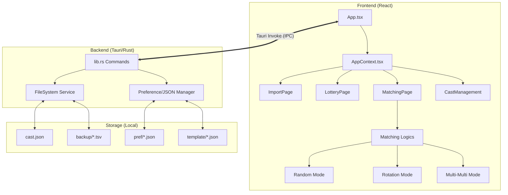

# Stargazer 超詳細機能仕様書 (v2.3)

**最終更新日:** 2026年2月23日  
**対象バージョン:** v2.3  
**プロジェクト形態:** Tauri 2 デスクトップアプリケーション (Windows 専用)

---

## 1. システム概要と技術コンセプト

### 1.1 アプリケーションの目的
Stargazer は、VRChat イベントやファンミーティング等のエンターテインメントイベントにおける「抽選（当選者の選出）」および「当選者とキャストのマッチング（ペアリング）」を、管理者がオフラインかつ安全に実行するための専用ツールです。

### 1.2 コアコンセプト：完全ローカル運用
本システムは「プライバシーの保護」と「確実な動作」を最優先とし、以下のコンセプトで設計されています。
- **外部通信ゼロ**: ユーザーデータ（名前や X ID）を外部 API に送信しません。
- **データ永続化**: すべての設定、テンプレート、および生成された結果は、ユーザーのローカルディスク（LocalAppData）に保存されます。
- **ポータビリティ**: インストール不要（または最小構成）で、TSV ファイルさえあれば即座に運用を開始できます。
- **高速計算**: 大規模な応募者データ（数千人規模）に対しても、ブラウザスレッド内で効率的にマッチング計算を行います。

### 1.3 採用技術スタック
- **Frontend Core**: React 18, Vite (TypeScript 設定)
- **Backend Core**: Rust (Tauri 2 基盤)
- **GUI IPC**: Tauri `invoke` による Frontend-Backend 通信
- **Styling**: Vanilla CSS (Discord 風ダークテーマ)
- **State Management**: React Context API (`AppContext`)
- **Icon Set**: Lucide-React

---

## 2. システムアーキテクチャ詳細

### 2.1 全体構成図 (Mermaid)



### 2.2 フロントエンド・詳細構造

#### 2.2.1 ディレクトリ構成の詳細
- **desktop/src/features/matching**: マッチングシステムの中枢。
    - `logics/`: アルゴリズムの実装。各ファイルは単独でテスト・デバッグ可能な独立性を保持。
        - `complete-random.ts`: M001 実装。
        - `rotation-cycle.ts`: M002 実装。
        - `multi-matching.ts`: M003 実装。
    - `components/`: マッチング結果を表示する `MatchedTable` や、NG挙動を切り替える `MatchingSettingsPanel` など。
- **desktop/src/features/lottery**: 抽選プロセス。
    - `LotteryPage.tsx`: 当選人数決定、テンプレート保存、抽選実行。
    - `LotteryResultTable.tsx`: 当選者のプレビュー。
- **desktop/src/features/ng-user**: 安全装置の管理。
    - `NGUserManagementPage.tsx`: NGリスト、要注意人物（Caution）、例外リスト（White-list）の管理。
- **desktop/src/features/import**: TSV 読み込みフロー。
    - `ImportPage.tsx`: フォーム連携、データクレンジング、列マッピングのUI。
- **desktop/src/common/**:
    - `types/`: `UserBean`, `CastBean`, `NGUserEntry` などの共通インターフェース。
    - `utils/`: `string-norm.ts`（正規化関数）、`csv-parser.ts`（高速パーサー）。

### 2.3 バックエンド・詳細実装 (Tauri / Rust)

#### 2.3.1 `lib.rs` の主要機能
Rust 側では、ファイルシステムの安全な操作と、OS 固有のパス解決（LocalAppData 等）に特化しています。

1. **整合性維持**: 書き込みコマンド (`write_cast_db_json` 等) は、一時ファイルへの書き込み後の名前変更 (rename) ではなく、直接書き込みを行っていますが、将来的にアトミック性を高めるためのバッファリング層を検討しています。
2. **ディレクトリ自動生成**: 起動時に以下の `stargazer_dir()` 下の構造を確認します。
   - `cast/`: キャストデータ
   - `template/`: 列マッピング設定
   - `backup/lottery/`: 抽選ログ
   - `backup/matching/`: マッチングログ
   - `pref/`: ユーザー設定（最後に開いたページ、抽選人数等）

#### 2.3.2 IPC (Command) 一覧
| コマンド | 引数 | 説明 |
| :--- | :--- | :--- |
| `get_app_data_dir` | なし | データの保存先ベースパスを返却。 |
| `read_cast_db_json` | なし | `cast/cast.json` を読み込み。 |
| `write_cast_db_json` | `content` | `cast/cast.json` に上書き保存。 |
| `write_backup_lottery_tsv`| `content` | タイムスタンプ付きで抽選結果を保存。 |
| `save_import_template` | `header`, `mapping` | TSVヘッダーとマッピングのペアを保存。 |
| `read_pref_json` | `name` | 指定名の設定ファイルを読み込み。 |

---

## 3. データモデルと定数定義

### 3.1 コアデータ構造 (TypeScript)

#### 3.1.1 `UserBean` (応募者・当選者)
```typescript
interface UserBean {
  name: string;           // 表示名（インポート元データ）
  x_id: string;           // X (Twitter) ID。検索・照合のキー。
  vrc_url?: string;       // (将来用) VRCプロフィールURL
  casts: string[];        // 希望キャスト配列（0番目=第1希望）
  is_guaranteed?: boolean; // 確定枠フラグ。抽選前に既に確定しているユーザー。
  raw_extra: unknown[];   // マッピングされなかった残りの列データ。
}
```

#### 3.1.2 `CastBean` (キャスト)
```typescript
interface CastBean {
  name: string;              // キャスト名
  is_present: boolean;       // 当日の出席状況フラグ
  contact_urls?: string[];   // Discord/X/VRCなどのURL配列
  ng_entries?: NGUserEntry[]; // 個別のNGリスト
}
```

#### 3.1.3 `NGUserEntry` (NG定義)
```typescript
interface NGUserEntry {
  username?: string;   // 照合対象の名前（部分一致不可、完全一致）
  accountId?: string;  // 照合対象のX ID（@の有無は吸収）
}
```

### 3.2 アプリケーション定数 (`constants.ts`)
- **MAX_ROTATIONS**: 20 (UI上の上限。ロジック上の制限はなし)
- **DEFAULT_THOROUGH_CHECK**: 2 (要注意人物としてマークするNG重複回数)
- **NG_JUDGMENT_TYPES**: `['username', 'accountId', 'either']`

---

## 4. 抽選プロセス (Lottery Engine) の詳細

### 4.1 抽選実行の内部ステップ
管理者が「抽選開始」ボタンをクリックした際のシーケンス：
1. **初期データ読み込み**: `AppContext` から全応募者を取得。
2. **確定枠の確保**: `is_guaranteed` が `true` のユーザーを抽出し、無条件で当選者リストの冒頭に挿入。
3. **一般枠の選出**:
    - 全応募者リストから確定枠ユーザーを除外。
    - 残りのリストを `Math.random()` ベースのシャッフル関数でランダム化。
    - 指定された `必要な抽選枠数` (= 総枠数 - 確定枠数) だけ先頭から取得。
4. **統合とバリデーション**:
    - リストを合算。
    - 同一 `x_id` による重複チェック（基本的にはインポート時に排除済み）。
5. **永続化**: 内部状態 `currentWinners` を更新し、`LotteryResultTable` に反映。

---

## 5. マッチングアルゴリズムの極詳細ロジック (M001-M003)

### 5.1 M001: ランダム希望優先マッチング (Random Matching)
**物理的挙動**: 毎ラウンド、キャストをテーブル間でシャッフル。

#### 詳細アルゴリズム
1. **出席キャストの特定**: `CastBean.is_present === true` のキャストリスト $C$ を取得。
2. **空席枠の挿入**: $TotalTables \times UsersPerTable$ に対して不足するユーザー数分、ダミーの「空席ユーザー」をリストに追加。
3. **ラウンドごとのループ ($r = 1 \dots Rotations$)**:
    - **キャストのシャッフル**: $C$ をランダムに入れ替える。
    - **ユーザー重要度の算定**:
        - これまでのラウンドで「第1〜第3希望」のいずれのキャストとも当たっていないユーザーを「重要度：高」に設定。
        - 各ユーザー $U$ に対し、現在のラウンドで配置可能なキャスト候補 $C_{rem}$ をリストアップ。
        - 各候補キャストに対して「希望順位ウェイト」を付与（1st: 1000, 2nd: 500, 3rd: 200, その他: 10）。
        - NG制約に抵触するキャストは、重みを 0 に設定（Exclude モード時）。
    - **最良配置の決定**: 重み付きランダム（Weighted Random Selection）を用いてキャストを決定。

### 5.2 M002: 全員巡回ローテーション (Rotation Matching)
**物理的挙動**: キャストがテーブルを円状に 1, 2, 3... と巡回。

#### 内部計算式 (オフセット計算)
本ロジックの肝は「全ユーザーの希望満足度の最大化」と「NG回避」を両立する「初期オフセット $O$」の算出にあります。
- **コスト関数 ($F(O)$)**:
  $$ F(O) = \sum_{Round} \sum_{Table} Satisfaction(User_{Table}, Cast_{(O + Table + Round) \pmod N}) $$
- **探索プロセス**:
  1. $O = 0 \dots N-1$ すべてに対して $F(O)$ を算出。
  2. 設定が `Exclude` モードの場合、判定関数 `isMatchNG(User, Cast)` が `true` となる組み合わせを 1 つでも含む $O$ は失格。
  3. 残った有効な $O$ の中で $F(O)$ が最大のものを採用。
  4. すべての $O$ が NG 制約により失格となった場合、システムは「NG回避不可」エラーをスロー。

### 5.3 M003: 複数対複数ユニット巡回 (Multi-Multi Mode)
**物理的挙動**: 3人のキャストが 1 ユニットとなり、3人のユーザーが座るテーブル A, B, C... を順次巡回。

#### 仕様詳細
- **分割ロジック**:
    - ユーザーリストを `usersPerTable` (例: 3人) のテーブル $T$ に分割。
    - キャストリストを `castsPerRotation` (例: 3人) のユニット $U$ に分割。
- **代数的一致**:
    - ユニット数がテーブル数より多い場合、待機ユニットが発生。
    - 逆にテーブル数がユニット数より多い場合、キャスト不在テーブルが発生。
    - 本システムでは巡回グラフの連続性を保つため、ダミーの「空ユニット」または「空テーブル」を補完して計算を行う。

---

## 6. 安全装置（NG管理・要注意人物）の内部仕様

### 6.1 正規化ロジックの詳細
すべての文字列比較は `desktop/src/common/utils/string-norm.ts` に集約されています。
- **入力**: ` " @MyID_123 " `
- **処理1 (`trim`)**: `"@MyID_123"`
- **処理2 (`toLowerCase`)**: `"@myid_123"`
- **処理3 (`removePrefix`)**: `"myid_123"`
これにより、ユーザーが入力した `@` の有無や大文字小文字に関わらず、確実な符号一致を実現します。

### 6.2 NG判定の段階解像度
1. **厳密モード (`strict`)**: 名前と X ID の両方が一致することを要求。
2. **片方一致モード (`flexible`)**: 名前または X ID のいずれかが一致すれば NG とする。
3. **ID優先モード**: 名前がどれほど似ていても、X ID が異なれば別人とみなす。
   ※ 現在の実装では管理画面の「NG判定基準」トグルによって制御されます。

### 6.3 要注意人物 (Caution Users) の定義
要注意人物とは、「複数のキャストから NG 指定を受けている要注意応募者」のことです。
- **検知タイミング**: TSV インポート直後、およびキャスト出欠変更時。
- **判定式**: $\sum_{cast \in Casts} IsNG(user, cast) \ge threshold$
- **UI表現**: データ確認画面において、名前の横に ⚠️ アイコンを表示し、マウスオーバーで「拒絶しているキャスト名一覧」をツールチップ表示します。

---

## 7. コンポーネントおよびUI仕様

### 7.1 Discord エステティック (Design System)
本アプリは Discord の UI デザインをリスペクトし、親しみやすさと視認性を両立しています。

- **配色パレット**:
    | 役割 | 色コード (Hex) | 用途 |
    | :--- | :--- | :--- |
    | Base Background | `#2b2d31` | アプリ全体の背景 |
    | Sidebar | `#1e1f22` | ナビゲーションメニュー |
    | Card Background | `#313338` | コンテンツエリア内のカード |
    | Blurple | `#5865f2` | プライバリボタン、アクティブ状態 |
    | Success | `#23a559` | 実行完了、出欠オン |
    | Danger | `#f23f43` | エラー、削除、NG警告 |

- **アニメーション規格**:
    - ページ遷移: `ease-in-out 0.2s` (スライド＋フェード)。
    - モーダル表示: `scale(0.9) -> scale(1.0)`。

### 7.2 高度な入力コンポーネント
- **Searchable Select**: 数百人のキャスト名からインクリメンタルサーチが可能なプルダウン。
- **Hot-key support**:
    - `Enter`: 実行/決定。
    - `Esc`: モーダルを閉じる。
    - `Ctrl + S`: (将来用) 手動バックアップ。

---

## 8. ディスク運用と永続化仕様

### 8.1 JSONデータ構造の詳細

#### `cast.json`
```json
{
  "version": "2.3",
  "lastUpdated": "2026-02-23T19:00:00Z",
  "casts": [
    {
      "id": "uuid-v4-string",
      "name": "キャスト名",
      "isPresent": true,
      "metadata": {
        "x_id": "@cast_x",
        "discord_id": "123456789"
      },
      "ng_entries": [ ... ]
    }
  ]
}
```

### 8.2 自動エクスポートとバックアップ
マッチング結果の TSV ファイル名は以下のルールで生成されます：
`matching_result_[MODE]_[DATE]_[TIME].tsv`
例: `matching_result_M001_20260223_183045.tsv`

---

## 9. ヘルプ・ガイドシステムの構成

ガイド画面 (`GuidePage.tsx`) は以下の構成となっています。
- **Interactive Checklist**: 運用者が当日行うべき手順（出欠確認、インポート...）をチェックリスト形式で提示。
- **Troubleshooting Tree**: 
    - 「インポート時にエラーが出る」→「ヘッダー名を確認してください」
    - 「マッチングが偏る」→「ランダムシード値をリセットしてください」
- **Video/GIF Placeholder**: 基本的な操作を 5 秒程度のループ動画で解説（現在は説明文と静止画サンプル）。

---

## 10. 拡張機能と開発ロードマップ

### 10.1 Discord URL 補完 (Advanced Interaction)
キャストの連絡先登録において `dscsv@<SERVER_ID>` と入力すると、内部的に `https://discord.com/channels/<SERVER_ID>` へ自動変換されるサニタイズ層を `CastForm.tsx` に実装。

### 10.2 過去ログの統計分析 (Analytics)
- どのキャストに希望が集中しているかのグラフ表示。
- ユーザーごとの「過去の当選回数」の累積と、それに基づいた「優先度調整（当選しにくくする設定）」の導入検討。

--- (End of Specification) ---
